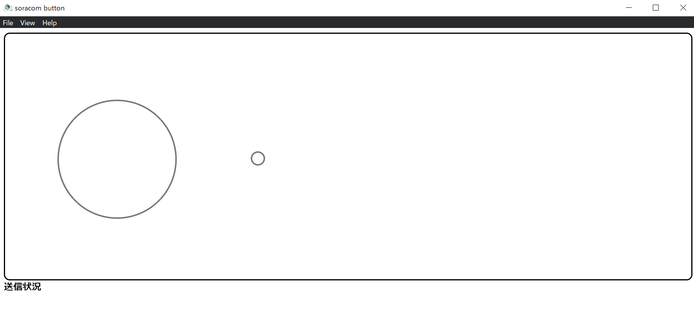
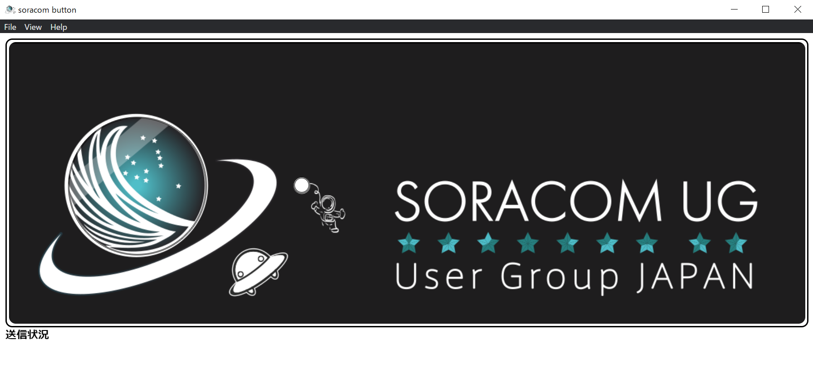

# SORACOM LTE-M Button for Enterprise シミュレータ

Windows/Macで動く[SORACOM LTE-M Button for Enterprise](https://users.soracom.io/ja-jp/guides/iot-devices/lte-m-button-enterprise/)シミュレータアプリです。

## インストール方法

リリースページから環境に合わせたバイナリをダウンロードして実行してください。

## ビルド方法

ソースツリー一式をcloneします。

Node.jsをインストールし、以下のコマンドを実行します。

```bash
% npm install
% npm run build-win64
```

Windows(32bit)の場合は`npm run build-win32`、Macの場合は`npm run build-mac`としてください。

distフォルダ以下に実行用ファイルが作成されます。

## 使い方

### SORACOMの準備

実行するPCは、SORACOM Airなどを用いてSORACOMプラットフォームにアクセスできるようにしておいてください。
また、受信データを確認するために、接続に利用しているSIMの所属するSIMグループでSORACOM Harvestを有効にしておいてください。

参考:
- [各種デバイスでSORACOM Airを使用する](https://users.soracom.io/ja-jp/guides/devices/general/)
- [SORACOM Harvest](https://soracom.jp/services/harvest/)

### 起動

ソフトを起動すると以下のようにメインウインドウが開きます。



### 終了
[File] > [終了]を選びます

### データを送信する

- ボタン(左の大きな丸)をクリックします
- LTE-M Buttonと同じくシングルクリック・ダブルクリック・ロングクリックができます
- ロングクリックは1秒以上押してからマウスのボタンを放してください(LTE-M Buttonと違い押しっぱなしでは動作しません。)

ボタンをクリックすると、左下の「送信状況」の所に「(SINGLE/DOUBLE/LONG)送信中」と出て、LED(右の小さな丸)がオレンジに点滅します。

ネットワークの状況にも因りますが5秒ほどで送信が完了し、送信に成功すればLEDが赤に、失敗すれば緑に点灯します。そして、「送信状況」の所に「送信完了(成功/失敗)」と、結果が表示されます。

### データを確認する

[SORACOMのユーザコンソール](https://console.soracom.io)から[データ収集・蓄積・可視化]→[SORACOM Harvest Data]に進み、確認します。

### 見た目を変更する

[View] > [見た目] > [UGバージョン]を選ぶと、SORACOM UGのステッカーを貼ったバージョンのボタンに変わります。動作は変わりません。

[View] > [サイズ] > [大/中/小]を選ぶと、サイズが変わります(デフォルト：大)



### SORACOMプラットフォームに送らずデータを確認する

SORACOMプラットフォームに送り込まずにデータを確認する場合は、JSONデータのPOSTを受け付けられるようなエンドポイントを[Mockbin](https://mockbin.org/)などで作成し、設定ファイルを修正してください。
設定ファイルはWindowsだと`c:/Users/(ユーザ名)/AppData/Roaming/soracom-button/config.json`、Macだと`~/Library/Application Support/soracom-button/config.json`です。

```json
{
        "endpoint": "http://uni.soracom.io"
}
```

このファイルの「endpoint」の値を修正してください。

# お問い合わせ

Twitterでハッシュタグ`#soracomug`をつけて呟くと作者かSORACOM UGの人が反応すると思いますがベストエフォートになりますので回答は気長に待ってください。

機能改善等はIssueあげるかプルリク送ってください。
